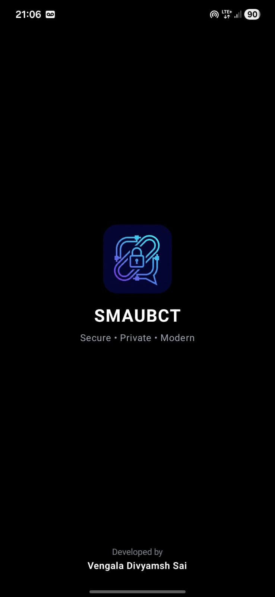
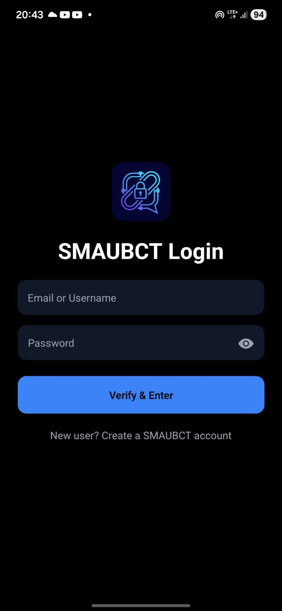
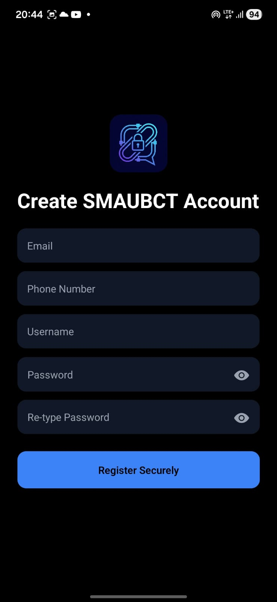
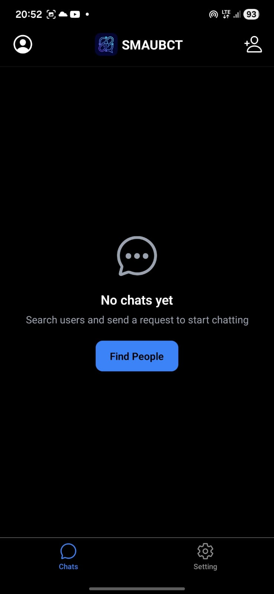
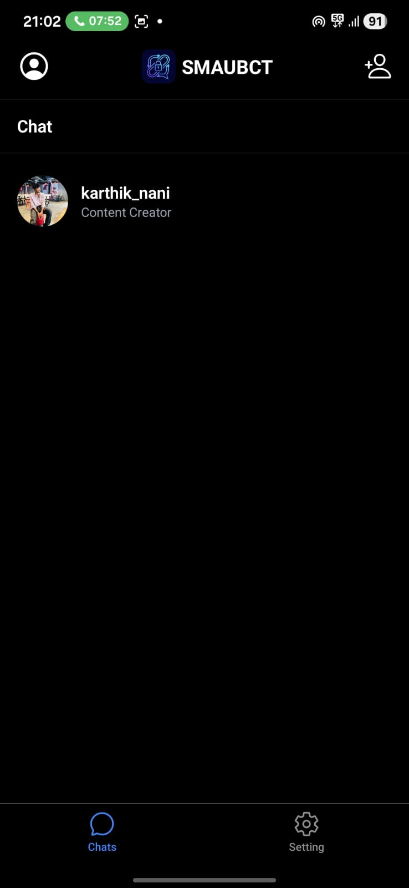
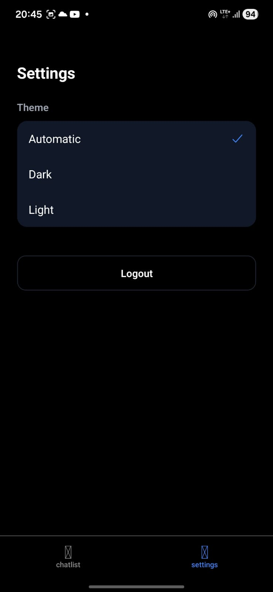

# 🚀 Secure Messaging App using Blockchain

A secure and decentralized messaging application built using React Native (Expo) that leverages blockchain principles to ensure privacy, integrity, and tamper-proof communication.

---

## 📱 Features

- 🔐 Secure Authentication (Login/Register)  
- 💬 Real-time Chat System  
- ⛓️ Blockchain-based Message Validation  
- 🔍 User Search  
- 👥 Chat Requests & Connections  
- 🔔 Notifications  
- 👤 User Profiles  
- ⚙️ Settings Management  

---

## 🛠️ Tech Stack

- Frontend: React Native (Expo Router)  
- Backend: Firebase (Authentication & Firestore)  
- Blockchain: Hashing / Decentralized Concepts  
- Language: TypeScript  
- Tools: Expo, AsyncStorage  

---

## 📂 Project Structure

```bash
app/
│
├── (tabs)/
│   ├── _layout.tsx
│   ├── chatlist.tsx
│   ├── settings.tsx
│
├── chat/
│   └── [id].tsx
│
├── user/
│   └── [id].tsx
│
├── _layout.tsx
├── index.tsx
├── splash.tsx
├── login.tsx
├── register.tsx
├── profile.tsx
├── search.tsx
├── requests.tsx
├── notifications.tsx
│
└── google-services.json
```

## ⚙️ Installation & Setup

1. Clone the repository
```bash
git clone https://github.com/idivysh/Secure-Messaging-Application-using-Blockchain-Technology
cd secure-messaging-blockchain
```
2. Install dependencies
```bash
npm install
```
3. Setup Firebase

- Add your google-services.json inside the app/ folder  
- Enable Authentication & Firestore in Firebase  

4. Run the app
```bash
npx expo start
```
---

## 📲 Run on Device

- Scan QR using Expo Go  
- Or run on:
  - Android Emulator  
  - iOS Simulator  

---

## ⛓️ Blockchain Concept Used

- Message hashing for integrity  
- Tamper-proof communication  
- Decentralized validation logic  

---

## 📸 Screenshots

### 🔐 Authentication

<p align="center">
  
  
  
</p>

---

### 💬 Chat & Messaging

<p align="center">
  
  
</p>

---

### 🔍 Search & Requests

<p align="center">
  
  
  
</p>

<p align="center">
  
  
  
</p>

---

### 👤 Profile & Settings

<p align="center">
  
  
  
</p>

---

## 🔮 Future Enhancements

- Web3 Wallet Login  
- IPFS Storage  
- Push Notifications  
- AI-based Spam Detection  
- Advanced UI/UX  

---

## 👨‍💻 Author

Divyamsh Sai Vengala  
Founder – Vijnah Media  
Web Developer | Freelance Graphic Designer | B.Tech AI & ML Student 

---

## ⭐ Support

If you like this project, give it a star on GitHub!
